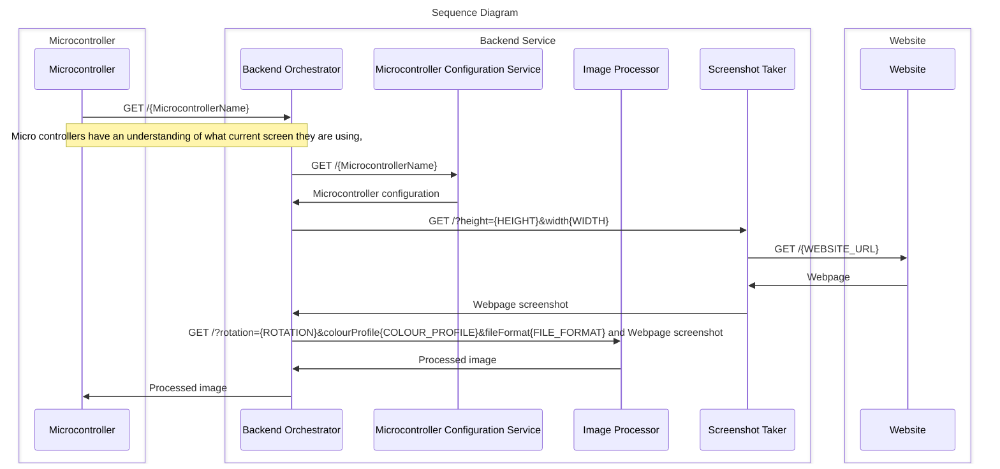
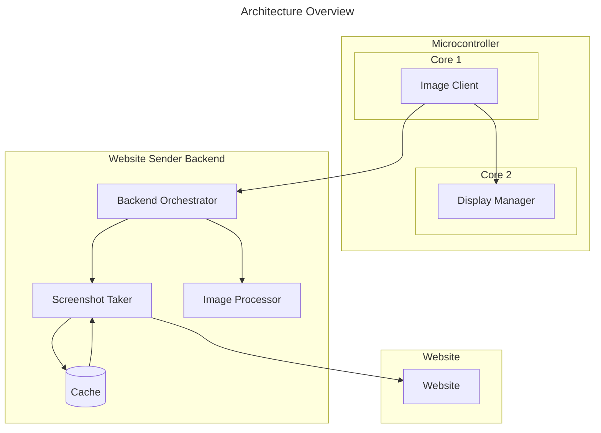

```mermaid
---
title: Sequence Diagram
---
sequenceDiagram

box Microcontroller
participant Microcontroller
end

box Backend Service
participant Backend Orchestrator
participant Microcontroller Configuration Service
participant Image Processor
participant Screenshot Taker
end

box Website
participant Website
end
Microcontroller ->> Backend Orchestrator: GET /{MicrocontrollerName}
Note over Microcontroller,Backend Orchestrator: Micro controllers have an understanding of what current screen they are using,

Backend Orchestrator ->> Microcontroller Configuration Service: GET /{MicrocontrollerName}
Microcontroller Configuration Service ->> Backend Orchestrator: Microcontroller configuration
Backend Orchestrator ->> Screenshot Taker: GET /?height={HEIGHT}&width{WIDTH}
Screenshot Taker ->> Website: GET /{WEBSITE_URL}
Website ->> Screenshot Taker: Webpage
Screenshot Taker ->> Backend Orchestrator: Webpage screenshot
Backend Orchestrator ->> Image Processor: GET /?rotation={ROTATION}&colourProfile{COLOUR_PROFILE}&fileFormat{FILE_FORMAT} and Webpage screenshot
Image Processor ->> Backend Orchestrator: Processed image
Backend Orchestrator ->> Microcontroller: Processed image


```

```mermaid
---
title: Architecture Overview
---
flowchart

subgraph Microcontroller
subgraph Core 2
displayManager[Display Manager]
end
subgraph Core 1
imageClient[Image Client]
end
imageClient-->displayManager
end

subgraph Website Sender Backend
backendOrchestrator[Backend Orchestrator]
screenshotTaker[Screenshot Taker]
imageProcessor[Image Processor]
cache[(Cache)]

backendOrchestrator-->screenshotTaker
backendOrchestrator-->imageProcessor
screenshotTaker-->cache-->screenshotTaker
end

subgraph Website
website[Website]
end

imageClient-->backendOrchestrator
screenshotTaker-->website
```