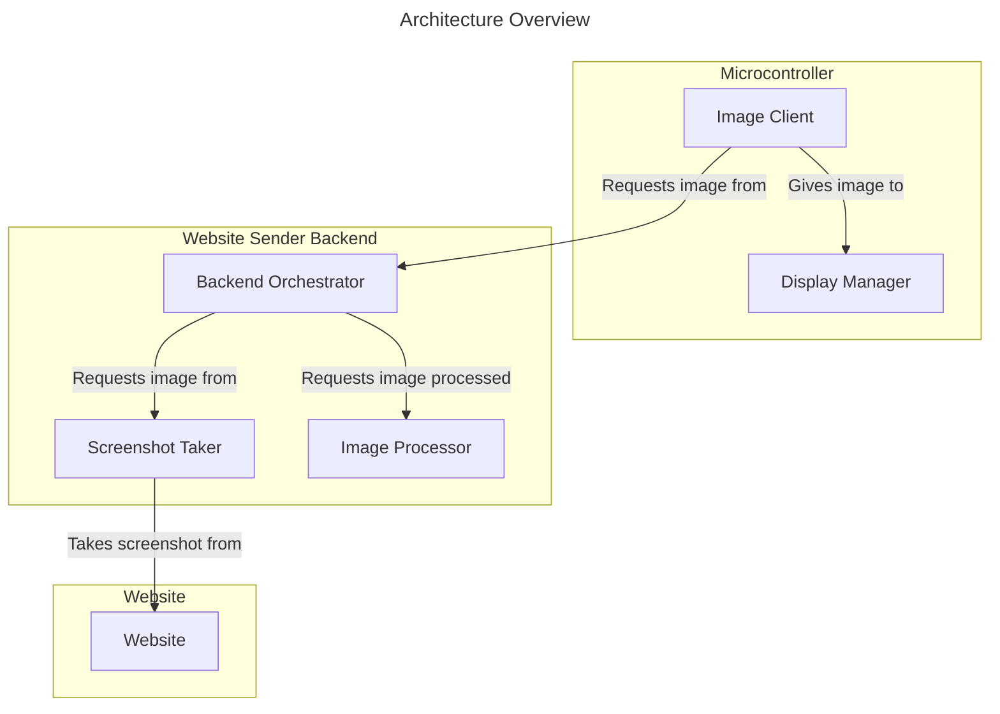
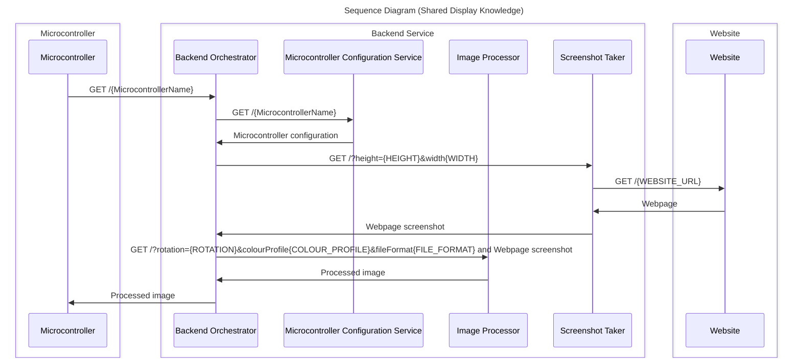

# Design Considerations
## Goals
### Must
- [ ] Display a screenshot of a web page.
- [ ] Support existing pico python implementation
- [ ] Support new pico c++ implemention
### Should
- [ ] Support multiple display types
- [ ] Support multple colour profiles
- [ ] Support multiple rotations
### Could
- [ ] Support eink hard/soft refresh
- [ ] Explore maximum speed of refresh (c++ only)
## Main concepts

### 

## Sequence diagrams -- Key decisions
There is currently reworking of the general architecture occuring prior to becoming too entrenched in a solution.

