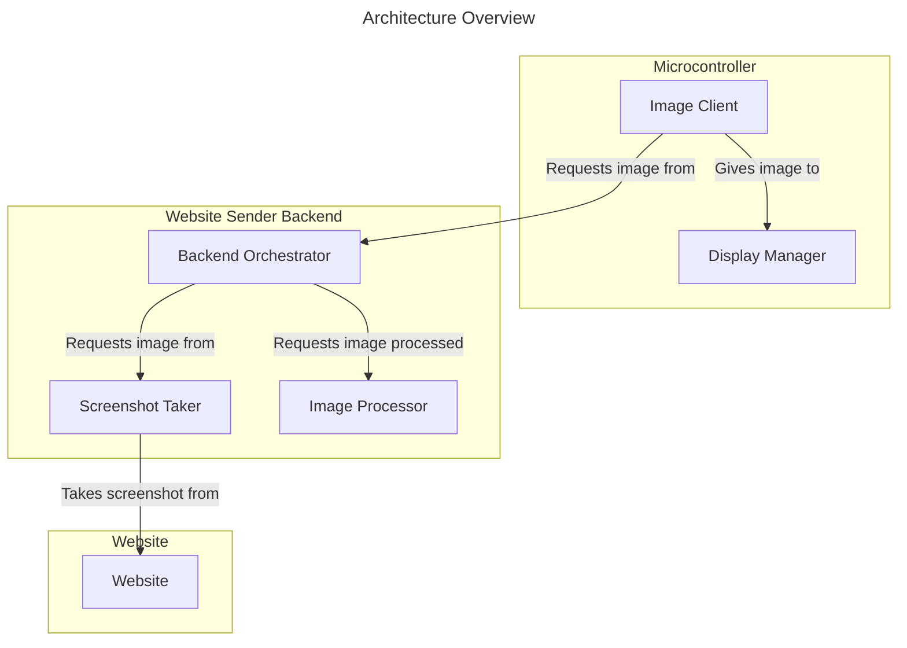
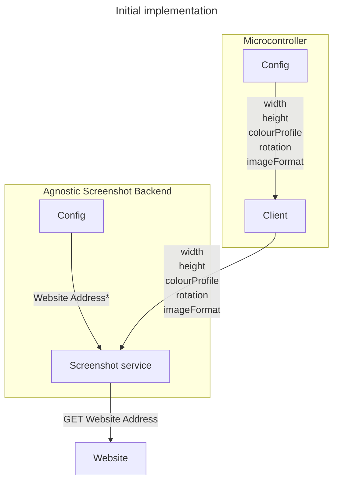
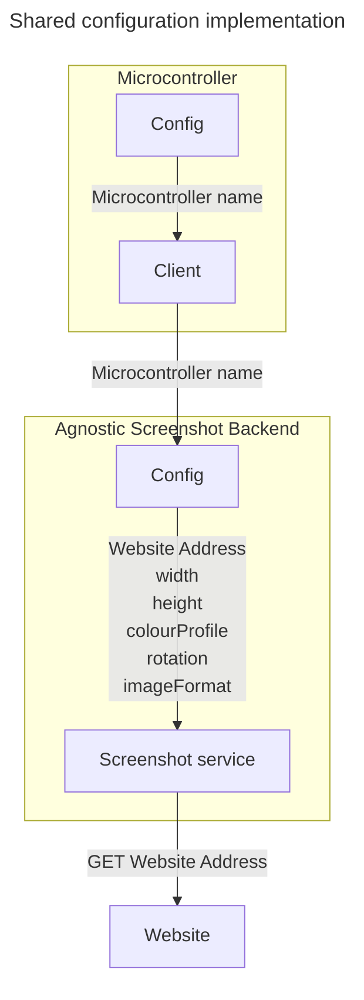
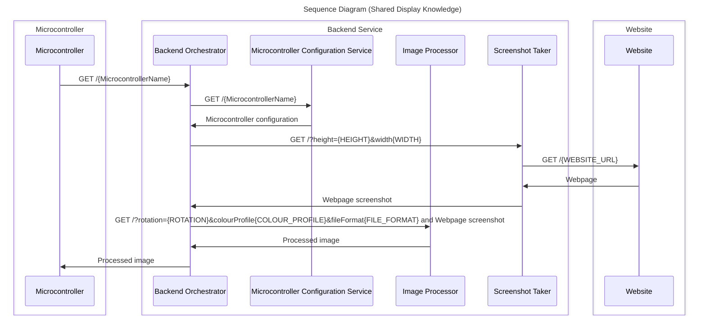
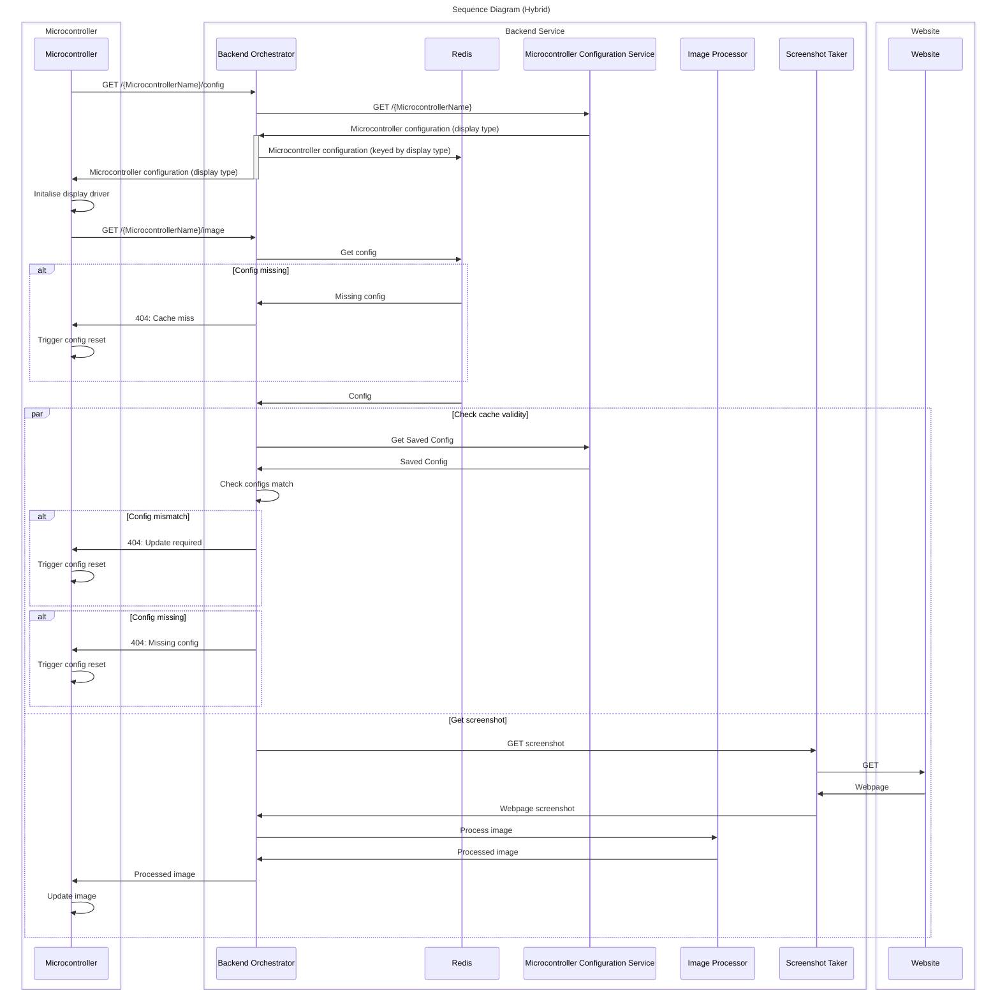

# Design Considerations
## Goals
### Must
- [ ] Display a screenshot of a web page.
- [ ] Support existing pico python implementation
- [ ] Support new pico c++ implemention
### Should
- [ ] Support multiple display types
- [ ] Support multple colour profiles
- [ ] Support multiple rotations
### Could
- [ ] Support eink hard/soft refresh
- [ ] Explore maximum speed of refresh (c++ only)
## Main concepts

### 

## Key decisions
### Single configuration vs sharing configuration
The question whether to split the configuration between the backend services and the picos, and if so, by how much is a core decision of this project.
#### Initial implementaiton
Initial implementaiton sees us have a simple process where the microcontroller knew everything about the display, as well as the configuration of the image it wants such as the width, height, colour profile, rotation and file format (note -- the rotation is required as several eink screens do not handle rotation well at all - slowing down refresh speed massively).

*note: website address could also be stored in the micro controller config

This allows for the remainder of the backend to be agnostic of displays -- it simply needs to know about the image, and nothing about the screen.

#### The argument towards sharing knowledge of the display configuration

This configuration has a downside however -- We cannot control the rotation, colour profile, image format or display type for each microcontroller without manually plugging them in and updating each configuration.

Through having the configuration living on the backend service, we can control these configurations quickly through a web accessible UI.

It further allows us to extend this configuration, and does a lot of work towards allowing each microcontroller to hit other websites.

However, when looking at the sequencing, we see a problem, especially if targetting low latency. That is that the lookups may be too time-costly to run each time.

#### The hybrid approach

